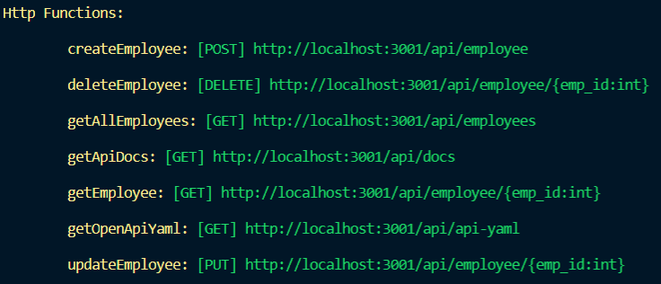
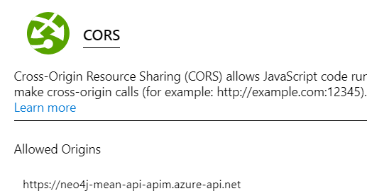

# Neo4j MEAN API - remote version
The simplest way to test the app - and API - is using the remote version, deployed on Microsoft Azure and publicly accessible through the Internet.

To access this version, [head over to the app](https://neo4j-mean-front.azurewebsites.net).

Otherwise, continue to the next section of this guide.

# Neo4j MEAN API - local version
You can also deploy the API and Neo4j graph database locally. To do so, follow the instructions below.

## Requirements
### - To run the API
You need to have installed :
* Node.js version 12 LTS from [here](https://nodejs.org/en/download/).
* Azure Functions Core Tools. To install it, execute the following command :
```bash
npm install -g azure-functions-core-tools
```

You also need to add a *local.settings.json* file to the root of the project, as per below.

```json
{
  "IsEncrypted": false,
  "Values": {
    "FUNCTIONS_WORKER_RUNTIME": "node"
  },
  "Host": {
    "LocalHttpPort": 3001,
    "CORS": "*"
  }
}
```

### - To run the Neo4j database
The API connects to a Neo4j graph database. You can either :
* Create one locally. To do so, [download Neo4j Desktop here](https://neo4j.com/download/).
* Use a Neo4j sandbox, hosted by Neo4j. To do so, [go here](https://neo4j.com/sandbox-v2/).
* Or you can use the one hosted by me - but it might be down at the time of your testing.

Regardless of your choice, you then need to provide the URL and Credentials to the API as environment variables. To do so, add the following entries to the *Values* section of your *local.settings.json* file.

```json
"NEO4J_URL": "bolt://<your-db-url>:7687", //51.132.30.232
"NEO4J_USERNAME": "<neo4j-username>", //neo4j
"NEO4J_PASSWORD": "<neo4j-password>" //pLPrOWgyvYi7
```

Note : I provided the values from my hosted Neo4j graph database. Yes, even the password, but there's no data on the db.

## Start Azure Functions
Once your Neo4j database is up and running, you can start the API.

Azure Functions Core Tools enables you to execute your Functions runtime locally. To do so, execute the following command :
```bash
func start
```
If everything is working properly, you should get the following CLI output :

To verify that the API is working properly, go to the following URL : <http://localhost:3001/api/employees>.

### Note on potential errors
Depending on the configuration of your machine, you might need to install the [.NET Core 2.x SDK](https://dotnet.microsoft.com/download).

This is because Functions are built on top on .NET Core. When you start the Functions runtime, it spins up a .NET Core runtime, in which the desired runtime of your functions - Node.js in our case - runs.

You normally don't need this with this project, as we make use of the extensions bundle. But just in case, here's a warning...

# OpenAPI documentation
I included the OpenAPI definition in this project. You can see the [YAML definition here](open-api-definition.yml).

I also created an API endpoint that returns the YAML file when you execute a GET request [/api/api-yaml](https://neo4j-mean-api-apim.azure-api.net/neo4j-mean-api/api-yaml), so that you can easily import it into SwaggerHub. This allows you to generate a UI documentation for the API using Swagger UI.

See the [UI Documentation of the API](https://app.swaggerhub.com/apis/mariusconjeaud/neo4j_mean_api/1.0-oas3).

Finally, I also exported a static HTML version of this UI, that I also serve through the API : [/api/docs](https://neo4j-mean-api-apim.azure-api.net/neo4j-mean-api/docs).

# Note on the remote version of the API
My API hosted on Azure is served through [Azure API Management](https://azure.microsoft.com/en-us/services/api-management/).

This gives me more control over the API in terms of security, addressing, monitoring. I could even provide subscription keys and usage quota, or create a full developer portal without going through SwaggerHub.

The only option I use in that project is delegating CORS to APIM. This way, my API only allows calls that originate from APIM ; while APIM filters the origins. As Azure Functions are consumption-based, this could limit the number of requests handled by them, and thus my costs.

